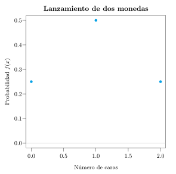
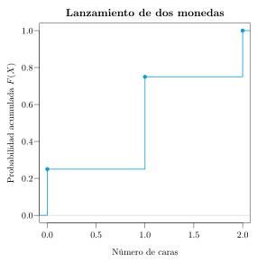
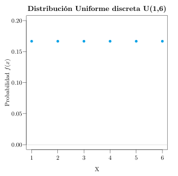
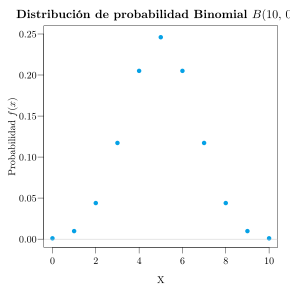
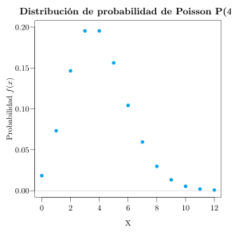
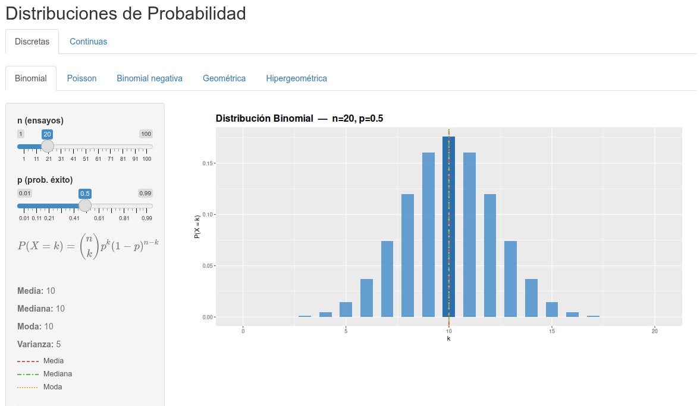

```{r setup, include=FALSE}
knitr::opts_chunk$set(echo = FALSE, message = FALSE, warning = FALSE)
# Colors
blueceu <- rgb(5,161,230,255,maxColorValue = 255) #0099CC
library(tidyverse)
```

Cuando seleccionamos una muestra al azar de una población estamos realizando un experimento aleatorio, y cualquier variable estadística medida a partir de la muestra será una variable aleatoria, porque sus valores dependerán del azar.

Con este capítulo entramos de lleno en la inferencia estadística, cuyo objetivo es construir modelos probabilísticos que expliquen el comportamiento de las variables en las poblaciones. Como los valores de una variable aleatoria provienen de la realización de un experimento aleatorio, tendrá asociada una determinada distribución de probabilidad. Nuestro objetivo es conocer lo mejor posible esa distribución, pero debemos recordar que, normalmente, no conoceremos con exactitud cómo se distribuyen los valores de la variable en la población, ya que no podremos medir a todos los individuos. Por tanto, los modelos de distribución de probabilidad que utilizaremos para describir el comportamiento de las variables en las poblaciones serán modelos aproximados.

## Variable aleatoria

:::{#def-variable-aleatoria}
## Variable aleatoria
Una *variable aleatoria* $X$ es una función que asocia un número real a cada elemento del espacio muestral de un experimento aleatorio.

$$
X:\Omega \rightarrow \mathbb{R}
$$

Al conjunto de posibles valores que puede tomar la variable aleatoria se le llama *rango* o *recorrido* de la variable, y se representa por $\mbox{Ran}(X)$.
:::

:::{#exm-variable-aleatoria-dado}
La variable $X$ que mide el resultado del lanzamiento de un dado es una variable aleatoria, y su rango es

$$
\mbox{Ran}(X)=\{1,2,3,4,5,6\}.
$$
:::

Las variables aleatorias se clasifican en dos tipos:

- **Discretas (VAD):** toman valores aislados, y su rango es numerable (finito o infinito numerable). Por ejemplo, el número de hijos, el número de cigarrillos o el número de asignaturas aprobadas.
- **Continuas (VAC):** toman valores en un intervalo real, y su rango es no numerable. Por ejemplo, el peso, la estatura, la edad o el nivel de colesterol.

Los modelos probabilísticos de cada tipo de variable tienen características diferenciadas, y por eso se estudian por separado. En este capítulo se estudian los modelos probabilísticos de las variables aleatorias discretas.

## Distribución de probabilidad de una variable aleatoria discreta

Como los valores de una variable aleatoria están asociados a los sucesos elementales del correspondiente experimento aleatorio, cada valor tendrá asociada una probabilidad.

:::{#def-funcion-probabilidad-discreta}
## Función de probabilidad
La *función de probabilidad* de una variable aleatoria discreta $X$ es una función $f(x)$ que asocia a cada valor de la variable su probabilidad

$$
f(x_i) = P(X=x_i).
$$
:::

Al igual que se acumulaban las frecuencias en las muestras, tiene sentido acumular probabilidades en las poblaciones. De eso se encarga la función de distribución.

:::{#def-funcion-distribucion-discreta}
## Función de distribución
La *función de distribución* de una variable aleatoria discreta $X$ es una función $F(x)$ que asocia a cada valor $x_i$ de la variable la probabilidad de que la variable tome un valor menor o igual que dicho valor

$$
F(x_i) = P(X\leq x_i) = f(x_1)+\cdots +f(x_i).
$$
:::

Al recorrido de la variable, junto a su función de probabilidad o de distribución, se le llama **distribución de probabilidad** de la variable. Tanto la función de probabilidad como la de distribución suelen representarse en forma de tabla:

$$
\begin{array}{|c|cccc|c|}
\hline
X & x_1 & x_2 & \cdots & x_n & \sum\\ \hline
f(x) & f(x_1) & f(x_2) & \cdots & f(x_n) & 1\\
\hline
F(x) & F(x_1) & F(x_2) & \cdots & F(x_n) =1 & \\
\hline
\end{array}
$$

Al igual que la distribución de frecuencias de una variable reflejaba cómo se distribuían los valores de la variable en una muestra, la distribución de probabilidad de una variable aleatoria sirve para reflejar cómo se distribuyen los valores de dicha variable en toda la población.

:::{#exm-distribucion-dos-monedas}
## Lanzamiento de dos monedas
Sea $X$ la variable aleatoria que mide el número de caras en el lanzamiento de dos monedas. El árbol de probabilidad del espacio probabilístico del experimento se muestra a continuación.

:::{.content-visible when-format="html"}
{width=60%}
:::

:::{.content-visible unless-format="html"}
{width=60%}
:::

Y según esto, su distribución de probabilidad es

$$
\begin{array}{|c|ccc|}
\hline
X & 0 & 1 & 2\\ \hline
f(x) & 0.25 & 0.5 & 0.25\\
\hline
F(x) & 0.25 & 0.75 & 1 \\
\hline
\end{array}
\qquad
F(x) =
\begin{cases}
0 & \mbox{si } x<0\\
0.25 & \mbox{si } 0\leq x< 1\\
0.75 & \mbox{si } 1\leq x< 2\\
1 & \mbox{si } x\geq 2
\end{cases}
$$
:::

La función de probabilidad y la de distribución también suelen representarse gráficamente, de igual modo que representábamos las frecuencias muestrales. Como se trata de variables discretas, el diagrama que se utiliza es el diagrama de barras o el diagrama de puntos, donde para cada valor se levanta una barra con el valor de la función de probabilidad o con el valor de la función de distribución.

:::{.content-visible when-format="html"}
{width=48%} {width=48%}
:::

:::{.content-visible unless-format="html"}
{width=48%} {width=48%}
:::

## Estadísticos poblacionales

Al igual que para describir las variables en las muestras se utilizan estadísticos descriptivos muestrales, para describir las características de las variables aleatorias se utilizan estadísticos poblacionales. Su definición es análoga a la de los muestrales, pero utilizando probabilidades en lugar de frecuencias relativas. Para distinguirlos de los muestrales, se suelen representar con letras griegas.

Los más importantes son:

- **Media o esperanza matemática:**

$$
\mu = E(X) = \sum_{i=1}^n x_i f(x_i).
$$

- **Varianza:**

$$
\sigma^2 = Var(X) = \sum_{i=1}^n x_i^2 f(x_i) -\mu^2.
$$

- **Desviación típica:**

$$
\sigma = +\sqrt{\sigma^2}.
$$

Es decir, si para la media muestral sumábamos el producto de cada valor por su frecuencia relativa, la media poblacional, también llamada esperanza matemática, se calcula sumando el producto de cada valor de la variable por su probabilidad. La varianza poblacional se calcula sumando los productos de los cuadrados de los valores de la variable por su probabilidad y restándole la media poblacional al cuadrado. La desviación típica poblacional, como siempre, es la raíz cuadrada positiva de la varianza.

Otros estadísticos se definen de forma similar a como lo hacíamos para muestras. Por ejemplo, la mediana será el valor cuya probabilidad acumulada sea $0.5$.

:::{#exm-estadisticos-dos-monedas}
## Estadísticos del lanzamiento de dos monedas
En el experimento aleatorio del lanzamiento de dos monedas, a partir de la distribución de probabilidad

$$
\begin{array}{|c|ccc|}
\hline
X & 0 & 1 & 2\\ \hline
f(x) & 0.25 & 0.5 & 0.25\\
\hline
F(x) & 0.25 & 0.75 & 1 \\
\hline
\end{array}
$$

se pueden calcular fácilmente los estadísticos poblacionales:

$$
\begin{aligned}
\mu &= \sum_{i=1}^n x_i f(x_i) = 0\cdot 0.25 + 1\cdot 0.5 + 2\cdot 0.25 = 1 \mbox{ cara},\\
\sigma^2 &= \sum_{i=1}^n x_i^2 f(x_i) -\mu^2 = (0^2\cdot 0.25 + 1^2\cdot 0.5 + 2^2\cdot 0.25) - 1^2 = 0.5 \mbox{ caras}^2,\\
\sigma &= +\sqrt{0.5} = 0.71 \mbox{ caras}.
\end{aligned}
$$
:::

## Modelos de distribución de probabilidad discretos

De acuerdo al tipo de experimento en el que se mide la variable aleatoria, existen diferentes modelos de distribución de probabilidad. En teoría, para obtener la distribución de probabilidad de una variable aleatoria en una población sería necesario conocer el valor de la variable en todos los individuos de la población, lo cual casi siempre es imposible. Sin embargo, dependiendo de la naturaleza del experimento, a veces es posible obtener la distribución de probabilidad de una variable aleatoria sin medirla en toda la población.

Los modelos discretos más habituales son:

- Distribución uniforme discreta.
- Distribución binomial.
- Distribución hipergeométrica.
- Distribución geométrica.
- Distribución binomial negativa.
- Distribución de Poisson.

### Distribución uniforme discreta

Cuando, por la simetría del experimento, todos los valores $a=x_1,\ldots,x_k=b$ de una variable discreta $X$ son igualmente probables, se dice que la variable sigue un *modelo de distribución uniforme*.

:::{#def-distribucion-uniforme-discreta}
## Distribución uniforme discreta $U(a,b)$
Se dice que una variable aleatoria $X$ sigue un *modelo de distribución uniforme* de parámetros $a$ y $b$, y se nota $X\sim U(a,b)$, si su rango es $\mbox{Ran}(X) = \{a, a+1, \ldots,b\}$ y su función de probabilidad vale

$$
f(x)=\frac{1}{b-a+1}.
$$
:::

Obsérvese que $a$ y $b$ son el mínimo y el máximo del rango, respectivamente.

Su media y varianza valen

$$
\mu = \sum_{i=0}^{b-a}\frac{a+i}{b-a+1}=\frac{a+b}{2} \qquad \sigma^2 =\sum_{i=0}^{b-a}\frac{(a+i-\mu)^2}{b-a+1}=
\frac{(b-a+1)^2-1}{12}.
$$

:::{#exm-uniforme-dado}
## Lanzamiento de un dado
La variable que mide el número obtenido al lanzar un dado sigue un modelo de distribución uniforme $U(1,6)$. Como puede tomar 6 valores distintos, del 1 al 6, su función de probabilidad es constante y vale $1/6$ para cualquier valor, tal y como se aprecia en la gráfica.

:::{.content-visible when-format="html"}
{width=60%}
:::

:::{.content-visible unless-format="html"}
{width=60%}
:::
:::

El modelo de distribución uniforme es el más sencillo, pero resulta poco útil en la práctica, ya que la equiprobabilidad no suele cumplirse fuera de los juegos de azar.

### Distribución binomial

Mucho más habitual es el modelo binomial, que suele darse en experimentos aleatorios con las siguientes características:

- El experimento consiste en una secuencia de $n$ repeticiones de un mismo ensayo aleatorio. Por ejemplo, tirar 10 veces una moneda.
- Los ensayos se realizan bajo idénticas condiciones, y cada uno de ellos tiene únicamente dos posibles resultados, que habitualmente se denotan por éxito ($A$) o fracaso ($\overline A$). Por ejemplo, en cada lanzamiento, cara (éxito) o cruz (fracaso).
- Los ensayos son independientes, por lo que el resultado de cualquier ensayo no influye sobre el resultado de ningún otro.
- La probabilidad de éxito es idéntica para todos los ensayos y vale $P(A)=p$. Por ejemplo, la probabilidad de sacar cara es $0.5$ en todos los lanzamientos.

En estas condiciones, la variable aleatoria $X$ que mide el número de éxitos obtenidos en los $n$ ensayos sigue un *modelo de distribución binomial* de parámetros $n$ y $p$. Así, la variable que mide el número de caras obtenidas en 10 lanzamientos de una moneda sigue un modelo de distribución binomial de parámetros $n=10$ y $p=0.5$.

:::{#def-distribucion-binomial}
## Distribución binomial $B(n,p)$
Se dice que una variable aleatoria $X$ sigue un *modelo de distribución binomial* de parámetros $n$ y $p$, y se nota $X\sim B(n,p)$, si su recorrido es $\mbox{Ran}(X) = \{0,1,\ldots,n\}$ y su función de probabilidad vale

$$
f(x) = \binom{n}{x}p^x(1-p)^{n-x} = \frac{n!}{x!(n-x)!}p^x(1-p)^{n-x}.
$$

donde $n$ es el número de repeticiones del ensayo y $p$ la probabilidad de éxito en cada repetición. El número combinatorio $\binom{n}{x}$ se define como $\frac{n!}{x!(n-x)!}$, siendo $n!$ el producto de todos los números consecutivos desde $1$ hasta $n$.
:::

Su media y su varianza valen

$$
\mu = n\cdot p \qquad \sigma^2 = n\cdot p\cdot (1-p).
$$

:::{#exm-binomial-10-monedas}
## Diez lanzamientos de una moneda
La variable que mide el número de caras obtenidas al lanzar 10 veces una moneda sigue un modelo de distribución binomial $B(10,\,0.5)$. En su gráfica se puede observar cómo se reparte la probabilidad entre los valores de 0 a 10. El 0 y el 10 tienen probabilidades muy bajas, ya que es muy difícil que al tirar diez veces una moneda no se obtenga ninguna cara, o que se obtengan 10. Lo más probable, como se aprecia en el gráfico, es sacar 5 caras, que además es su media.

:::{.content-visible when-format="html"}
{width=60%}
:::

:::{.content-visible unless-format="html"}
{width=60%}
:::
:::

:::{#exm-binomial-calculos-monedas}
## Cálculos con la binomial
Sea $X\sim B(10,\,0.5)$ la variable que mide el número de caras en 10 lanzamientos de una moneda. Entonces:

- La probabilidad de sacar 4 caras es

$$
f(4) = \binom{10}{4}0.5^4 (1-0.5)^{10-4} = \frac{10!}{4!6!}0.5^4\, 0.5^6 = 210\cdot 0.5^{10} = 0.2051.
$$

- La probabilidad de sacar dos o menos caras es

$$
\begin{aligned}
F(2) &= f(0) +f(1) + f(2) =\\
&= \binom{10}{0}0.5^0 (1-0.5)^{10-0} + \binom{10}{1}0.5^1 (1-0.5)^{10-1} + \binom{10}{2}0.5^2 (1-0.5)^{10-2} =\\
&= 0.0547.
\end{aligned}
$$

- El número esperado de caras, es decir, la media, es

$$
\mu = 10\cdot 0.5 = 5 \mbox{ caras}.
$$
:::

Conocer la fórmula de la función de probabilidad de la binomial facilita mucho el cálculo de probabilidades para esta variable.

:::{#exm-binomial-muestra-reemplazamiento}
## Muestra aleatoria con reemplazamiento
En una población hay un 40% de fumadores. La variable $X$ que mide el número de fumadores en una muestra aleatoria con reemplazamiento de 3 personas sigue un modelo de distribución binomial $X\sim B(3,\,0.4)$.

:::{.content-visible when-format="html"}
{width=70%}
:::

:::{.content-visible unless-format="html"}
{width=70%}
:::

Sus probabilidades son

$$
\renewcommand{\arraystretch}{1.5}
\begin{array}{lll}
f(0)=\binom{3}{0}0.4^0(1-0.4)^{3-0}= 0.6^3, & \quad &
f(1)=\binom{3}{1}0.4^1(1-0.4)^{3-1}= 3\cdot 0.4\cdot 0.6^2,\\
f(2)=\binom{3}{2}0.4^2(1-0.4)^{3-2}= 3\cdot 0.4^2\cdot 0.6, & &
f(3)=\binom{3}{3}0.4^3(1-0.4)^{3-3}= 0.4^3.
\end{array}
$$
:::

### Distribución hipergeométrica

En el modelo binomial los ensayos son independientes y la probabilidad de éxito es la misma en todos ellos, lo que ocurre, por ejemplo, cuando se extrae una muestra aleatoria con reemplazamiento. Sin embargo, cuando la muestra se extrae sin reemplazamiento de una población finita, la composición de la población cambia tras cada extracción, de manera que los ensayos dejan de ser independientes y la probabilidad de éxito varía de un ensayo a otro. En estas circunstancias, si en una población de $N$ individuos hay $K$ que presentan una determinada característica (éxitos), la variable aleatoria $X$ que mide el número de éxitos en una muestra aleatoria sin reemplazamiento de $n$ individuos sigue un *modelo de distribución hipergeométrica*.

:::{#def-distribucion-hipergeometrica}
## Distribución hipergeométrica $H(N,K,n)$
Se dice que una variable aleatoria $X$ sigue un *modelo de distribución hipergeométrica* de parámetros $N$, $K$ y $n$, y se nota $X\sim H(N,K,n)$, si su rango es $\mbox{Ran}(X) = \{\max(0,n-N+K),\ldots,\min(n,K)\}$ y su función de probabilidad vale

$$
f(x) = \frac{\binom{K}{x}\binom{N-K}{n-x}}{\binom{N}{n}},
$$

donde $N$ es el tamaño de la población, $K$ el número de éxitos en la población y $n$ el tamaño de la muestra.
:::

La fórmula se obtiene aplicando la regla de Laplace: $\binom{N}{n}$ es el número de muestras posibles de tamaño $n$, mientras que $\binom{K}{x}\binom{N-K}{n-x}$ es el número de muestras con exactamente $x$ éxitos y $n-x$ fracasos.

Si llamamos $p=K/N$ a la proporción de éxitos en la población, su media y su varianza valen

$$
\mu = n\cdot p \qquad \sigma^2 = n\cdot p\cdot (1-p)\frac{N-n}{N-1}.
$$

Obsérvese que la media coincide con la de la binomial $B(n,p)$, pero la varianza es menor, ya que se multiplica por el factor $\frac{N-n}{N-1}<1$, conocido como *factor de corrección para poblaciones finitas*. Cuando el tamaño de la población $N$ es muy grande en comparación con el de la muestra $n$, este factor es prácticamente 1, y extraer un individuo apenas cambia la composición de la población, por lo que la distribución hipergeométrica $H(N,K,n)$ puede aproximarse mediante la binomial $B(n,K/N)$. En la práctica, esta aproximación suele utilizarse cuando $n\leq 0.05N$.

:::{#exm-hipergeometrica-muestra-sin-reemplazamiento}
## Muestra aleatoria sin reemplazamiento
En un grupo de 20 pacientes hay 8 fumadores. Si se eligen al azar 5 pacientes sin reemplazamiento, la variable $X$ que mide el número de fumadores en la muestra sigue un modelo de distribución hipergeométrica $X\sim H(20,8,5)$, y la gráfica de su función de probabilidad es la siguiente.

```{r}
#| label: fig-hipergeometrica-20-8-5
#| fig-cap: "Función de probabilidad de la distribución hipergeométrica $H(20,8,5)$."
#| fig-alt: "Diagrama de puntos con las probabilidades de obtener entre 0 y 5 fumadores, con el máximo en 2 fumadores."
#| fig-align: center
#| fig-width: 6
#| fig-height: 3.5
df <- tibble(
  x = 0:5,  # Rango
  p = dhyper(0:5, m = 8, n = 12, k = 5) # Probabilidad
)
# Diagrama de puntos
ggplot(df, aes(x = x, y = p)) +
  geom_point(color = blueceu, size = 2) +
  scale_x_continuous(breaks = 0:5) +
  labs(x = "Número de fumadores en la muestra", y = "Probabilidad") +
  theme_minimal()
```

Entonces:

- La probabilidad de que haya exactamente 2 fumadores en la muestra es

$$
f(2) = \frac{\binom{8}{2}\binom{12}{3}}{\binom{20}{5}} = \frac{28\cdot 220}{15504} = 0.3973.
$$

- La probabilidad de que haya al menos un fumador en la muestra es

$$
P(X\geq 1) = 1-f(0) = 1-\frac{\binom{8}{0}\binom{12}{5}}{\binom{20}{5}} = 1-\frac{792}{15504} = 1-0.0511 = 0.9489.
$$

- El número esperado de fumadores en la muestra y su varianza son

$$
\mu = 5\cdot\frac{8}{20} = 2 \mbox{ fumadores}, \qquad \sigma^2 = 5\cdot 0.4\cdot 0.6\cdot\frac{20-5}{20-1} = 0.9474 \mbox{ fumadores}^2.
$$

Si la muestra se hubiese extraído con reemplazamiento, el número de fumadores seguiría una distribución binomial $B(5,\,0.4)$, con la misma media, 2 fumadores, pero con una varianza mayor, $5\cdot 0.4\cdot 0.6 = 1.2$ fumadores$^2$. En este caso no conviene aproximar la hipergeométrica mediante la binomial, ya que la muestra supone una cuarta parte de la población.
:::

### Distribución geométrica

Cuando en lugar de fijar el número de repeticiones de un ensayo con dos posibles resultados, éxito o fracaso, se repite el ensayo hasta obtener el primer éxito, la variable que mide el número de fracasos obtenidos antes del primer éxito sigue un *modelo de distribución geométrica*.

:::{#def-distribucion-geometrica}
## Distribución geométrica $G(p)$
Se dice que una variable aleatoria $X$ sigue un *modelo de distribución geométrica* de parámetro $p$, y se nota $X\sim G(p)$, si su rango es $\mbox{Ran}(X)=\{0,1,2,\ldots\}$ y su función de probabilidad vale

$$
f(x) = (1-p)^{x}p,
$$

donde $p$ es la probabilidad de éxito en cada ensayo.
:::

El modelo geométrico se utiliza para modelar el número de fracasos necesarios hasta obtener el primer éxito en una serie de ensayos independientes con dos posibles resultados, como el número de pacientes sanos que se examinan hasta encontrar un paciente enfermo.

Su media y su varianza valen

$$
\mu = \frac{1-p}{p} \qquad \sigma^2 = \frac{1-p}{p^2}.
$$

:::{#exm-distribucion-geometrica}
## Número de no fumadores hasta el primer fumador
En una población hay aproximadamente un 30% de fumadores. La variable que mide el número de personas no fumadoras que hay que examinar hasta encontrar la primera persona fumadora sigue una distribución geométrica $G(0.3)$.

```{r}
#| label: fig-geometrica-03
#| fig-cap: "Función de probabilidad de la distribución geométrica $G(0.3)$, truncada en 14 fracasos."
#| fig-alt: "Diagrama de puntos decreciente con la probabilidad de encontrar la primera persona fumadora tras x no fumadoras."
#| fig-align: center
#| fig-width: 6
#| fig-height: 3.5
df <- tibble(
  x = 0:14,  # Rango truncado (número de fracasos)
  p = dgeom(0:14, prob = 0.3) # Probabilidad
)
# Diagrama de puntos
ggplot(df, aes(x = x, y = p)) +
  geom_point(color = blueceu, size = 2) +
  scale_x_continuous(breaks = 0:14) +
  labs(x = "Número de no fumadoras hasta la primera fumadora", y = "Probabilidad") +
  theme_minimal()
```
:::

La siguiente figura muestra las gráficas de las funciones de probabilidad de distribuciones geométricas con distintos valores de $p$.

```{r}
#| label: fig-geometrica-formas
#| fig-cap: "Forma de la distribución geométrica para distintos valores de $p$."
#| fig-alt: "Tres diagramas de puntos de distribuciones geométricas con p = 0.1, 0.5 y 0.9; cuanto mayor es p, más concentrada está la probabilidad en valores bajos."
#| fig-align: center
#| fig-width: 8
#| fig-height: 3
ps <- c(0.1, 0.5, 0.9)
df_geom <- tibble(p = ps) |>
  rowwise() |>
  mutate(x = list(0:14), prob = list(dgeom(0:14, prob = p))) |>
  unnest(cols = c(x, prob)) |>
  mutate(label = factor(paste0("p == ", p),
                        levels = paste0("p == ", ps)))
df_geom |>
  ggplot(aes(x = x, y = prob)) +
  geom_point(color = blueceu, size = 1.5) +
  facet_wrap(~ label, nrow = 1, labeller = label_parsed) +
  labs(x = "X", y = "Probabilidad") +
  theme_minimal() +
  theme(strip.text = element_text(size = 11))
```
Como se puede observar, cuanto mayor es la probabilidad de éxito, más concentrada está la probabilidad en los valores bajos, ya que es más probable obtener el primer éxito tras pocos fracasos.

### Distribución binomial negativa

La distribución binomial negativa generaliza la geométrica: en lugar de repetir el ensayo hasta obtener el primer éxito, se repite hasta obtener un número fijo $r$ de éxitos, y la variable mide el número de fracasos obtenidos antes de alcanzarlos.

:::{#def-distribucion-binomial-negativa}
## Distribución binomial negativa $BN(r,p)$
Se dice que una variable aleatoria $X$ sigue un *modelo de distribución binomial negativa* de parámetros $r$ y $p$, y se nota $X\sim BN(r, p)$, si su rango es $\mbox{Ran}(X)=\{0, 1, 2, \ldots\}$ y su función de probabilidad vale

$$
f(x) = \binom{r+x-1}{x}p^r(1-p)^{x},
$$

donde $r$ es el número de éxitos y $p$ la probabilidad de éxito en cada ensayo.
:::

El modelo binomial negativo se utiliza para modelar el número de fracasos necesarios para obtener $r$ éxitos en una serie de ensayos independientes con dos posibles resultados, como el número de pacientes sanos que se examinan hasta encontrar el tercer paciente enfermo. Obsérvese que la distribución geométrica es un caso particular de la binomial negativa con $r=1$, es decir, $G(p)=BN(1,p)$.

Su media y su varianza valen

$$
\mu = \frac{r(1-p)}{p} \qquad \sigma^2 = \frac{r(1-p)}{p^2}.
$$

:::{#exm-distribucion-binomial-negativa}
## Número de no fumadores hasta el tercer fumador
En una población hay aproximadamente un 30% de fumadores. La variable que mide el número de personas no fumadoras que hay que examinar hasta encontrar 3 personas fumadoras sigue una distribución binomial negativa $BN(3, 0.3)$.

```{r}
#| label: fig-binomial-negativa-3-03
#| fig-cap: "Función de probabilidad de la distribución binomial negativa $BN(3, 0.3)$, truncada en 25 fracasos."
#| fig-alt: "Diagrama de puntos de la distribución binomial negativa con r = 3 y p = 0.3, con la probabilidad concentrada entre 0 y 15 no fumadoras."
#| fig-align: center
#| fig-width: 6
#| fig-height: 3.5
df <- tibble(
  x = 0:25,  # Rango truncado (número de fracasos)
  p = dnbinom(0:25, size = 3, prob = 0.3) # Probabilidad
)
# Diagrama de puntos
ggplot(df, aes(x = x, y = p)) +
  geom_point(color = blueceu, size = 2) +
  scale_x_continuous(breaks = seq(0, 25, by = 5)) +
  labs(x = "Número de no fumadoras hasta la tercera fumadora", y = "Probabilidad") +
  theme_minimal()
```
:::

La siguiente figura muestra las gráficas de las funciones de probabilidad de distribuciones binomiales negativas con distintos valores de $r$ y $p$. 

```{r}
#| label: fig-binomial-negativa-formas
#| fig-cap: "Forma de la distribución binomial negativa para distintos valores de $r$ y $p$."
#| fig-alt: "Nueve diagramas de puntos de distribuciones binomiales negativas combinando r = 1, 3 y 5 con p = 0.2, 0.5 y 0.8."
#| fig-align: center
#| fig-width: 7
#| fig-height: 7
params <- expand.grid(r = c(1, 3, 5), p = c(0.2, 0.5, 0.8))
df_binom <- params |>
  rowwise() |>
  mutate(x = list(0:30), prob = list(dnbinom(0:30, size = r, prob = p))) |>
  unnest(cols = c(x, prob)) |>
  mutate(
    label = factor(
      paste0("r = ", r, ", p = ", p),
      levels = paste0("r = ", rep(c(1, 3, 5), 3), ", p = ", rep(c(0.2, 0.5, 0.8), each = 3))
    )
  )

df_binom |>
  ggplot(aes(x = x, y = prob)) +
  geom_point(color = blueceu, size = 1.5) +
  facet_wrap(~ label, scales = "free", nrow = 3) +
  labs(x = "X", y = "Probabilidad") +
  theme_minimal() +
  theme(strip.text = element_text(size = 11))
```

Como se puede observar, para $r=1$ la distribución coincide con la geométrica, mientras que al aumentar $r$ o disminuir $p$ la probabilidad se desplaza hacia valores más altos y la distribución se vuelve más dispersa.

### Distribución de Poisson

La distribución de Poisson surge en experimentos aleatorios con las siguientes características:

- El experimento consiste en observar la aparición de sucesos puntuales sobre un soporte continuo, ya sea en un intervalo fijo de tiempo o en un espacio. Por ejemplo, averías de máquinas en un período de tiempo, llamadas recibidas en una centralita, número de linfocitos en un volumen de sangre, etc.
- Los sucesos ocurren de forma independiente.
- El experimento produce, a largo plazo, un número medio constante $\lambda$ de sucesos puntuales por unidad de soporte continuo.

En estas circunstancias, la variable aleatoria $X$ que mide el número de ocurrencias del fenómeno en el intervalo considerado sigue un *modelo de distribución de Poisson* de parámetro $\lambda$.

:::{#def-distribucion-poisson}
## Distribución de Poisson $P(\lambda)$
Se dice que una variable aleatoria $X$ sigue un *modelo de distribución de Poisson* de parámetro $\lambda$, y se nota $X\sim P(\lambda)$, si su rango es $\mbox{Ran}(X) = \{0,1,\ldots,\infty\}$ y su función de probabilidad vale

$$
f(x) = e^{-\lambda}\frac{\lambda^x}{x!}.
$$
:::

Obsérvese que $\lambda$ es el número medio de sucesos en el intervalo unidad de referencia, y cambiará si se cambia la amplitud del intervalo. Además, su media y su varianza valen

$$
\mu = \lambda \qquad \sigma^2 = \lambda.
$$

:::{#exm-poisson-ingresos-hospital}
## Ingresos diarios en un hospital
Sea un hospital en el que se producen por término medio 4 ingresos diarios. La variable aleatoria $X$ que mide el número de ingresos en un día sigue un modelo de distribución de Poisson $X\sim P(4)$, y la gráfica de su función de probabilidad es la siguiente. Aunque teóricamente la variable podría tomar valores hasta $\infty$, la probabilidad de que ocurran más de 10 ingresos ya es casi despreciable.

:::{.content-visible when-format="html"}
{width=60%}
:::

:::{.content-visible unless-format="html"}
{width=60%}
:::
:::

:::{#exm-poisson-calculos-hospital}
## Cálculos con la Poisson
Sea $X\sim P(4)$ la variable que mide el número de ingresos diarios en el hospital. Entonces:

- La probabilidad de que un día cualquiera se produzcan 5 ingresos es

$$
f(5) = e^{-4}\frac{4^5}{5!} = 0.1563.
$$

- La probabilidad de que un día se produzcan menos de 2 ingresos es

$$
F(1) = f(0)+f(1) = e^{-4}\frac{4^0}{0!} + e^{-4}\frac{4^1}{1!} = 5e^{-4} = 0.0916.
$$

- La probabilidad de que un día se produzcan más de 1 ingreso es

$$
P(X>1) = 1- P(X\leq 1) = 1- F(1) = 1- 0.0916 = 0.9084.
$$

Obsérvese que, para calcular $P(X>1)$, hemos tenido que recurrir a la probabilidad del suceso contrario, ya que de otro modo habría que sumar $f(2)+f(3)+\cdots$ hasta infinito.
:::

### Aproximación de la binomial mediante la Poisson

El modelo de distribución de Poisson surge a partir del modelo binomial cuando el número de repeticiones del ensayo tiende a infinito y la probabilidad de éxito tiende a cero.

:::{#thm-ley-casos-raros}
## Ley de los casos raros
La distribución binomial $X\sim B(n,p)$ tiende a la distribución de Poisson $P(\lambda)$, con $\lambda=n\cdot p$, cuando $n$ tiende a infinito y $p$ tiende a cero, es decir,

$$
\lim_{n\rightarrow \infty, p\rightarrow 0}\binom{n}{x}p^x(1-p)^{n-x} = e^{-\lambda}\frac{\lambda^x}{x!}.
$$
:::

En la práctica, esta aproximación suele utilizarse para $n\geq 30$ y $p\leq 0.1$, de modo que, en tales circunstancias, la variable $X\sim B(n,p)$ puede aproximarse mediante el modelo de Poisson $P(n\cdot p)$.

:::{#exm-aproximacion-poisson-vacuna}
## Reacciones adversas a una vacuna
Se sabe que una vacuna produce una reacción adversa en el 4% de los casos. Si se vacunan 50 personas, ¿cuál es la probabilidad de que haya más de 2 personas con reacción adversa?

La variable que mide el número de personas con reacción adversa entre las 50 vacunadas sigue un modelo de distribución binomial $X\sim B(50,\,0.04)$. Pero como $n=50>30$ y $p=0.04<0.1$, se cumplen las condiciones de la ley de los casos raros, y se puede aproximar mediante una distribución de Poisson $P(50\cdot 0.04)=P(2)$.

Así pues, utilizando la fórmula de la función de probabilidad de la distribución de Poisson, se tiene

$$
\begin{aligned}
P(X>2) &= 1 -P(X\leq 2) = 1-f(0)-f(1)-f(2) = 1-e^{-2}\frac{2^0}{0!}-e^{-2}\frac{2^1}{1!}-e^{-2}\frac{2^2}{2!} =\\
&= 1-5e^{-2} = 0.3233.
\end{aligned}
$$
:::

## Aplicación para las distribuciones de probabilidad discretas

El siguiente enlace lleva a una aplicación web interactiva que permite visualizar las principales distribuciones de probabilidad discretas, explorando cómo cambian su función de probabilidad y su función de distribución al modificar sus parámetros.

[](https://nube.aprendeconalf.es/shiny/distribuciones/)
