```{r setup, include=FALSE}
knitr::opts_chunk$set(echo = FALSE, message = FALSE, warning = FALSE)
# Colors
blueceu <- rgb(5,161,230,255,maxColorValue = 255) #0099CC
library(tidyverse)
```

Las variables aleatorias continuas, a diferencia de las discretas, se caracterizan porque pueden tomar cualquier valor en un intervalo real. Es decir, el conjunto de valores que pueden tomar no solo es infinito, sino que además es no numerable.

Esta densidad de valores hace imposible calcular la probabilidad de cada uno de ellos, y por tanto no podemos definir los modelos de distribución de probabilidad por medio de una función de probabilidad como en el caso discreto.

Por otro lado, la medida de una variable aleatoria continua suele estar limitada por la precisión del proceso o del instrumento de medida. Por ejemplo, conocer la estatura exacta de una persona es imposible, ya que no se dispone de un instrumento de medida de precisión infinita. Cuando se dice que una estatura es $1.68$ m, no se está diciendo que es exactamente $1.68$ m, sino que la estatura está entre $1.675$ y $1.685$ m, ya que el instrumento de medida solo es capaz de precisar hasta el centímetro.

Así pues, en el caso de variables continuas **no tiene sentido medir probabilidades de valores aislados, sino que se medirán probabilidades de intervalos.**

## Distribución de probabilidad de una variable continua

Para conocer cómo se distribuye la probabilidad entre los valores de una variable aleatoria continua se utiliza una función equivalente a la función de probabilidad de las variables discretas, pero continua. Esta función se conoce como *función de densidad*.

:::{#def-funcion-densidad}
## Función de densidad de probabilidad
La *función de densidad de probabilidad* de una variable aleatoria continua $X$ es una función $f(x)$ que cumple las siguientes propiedades:

- Es no negativa: $f(x)\geq 0$ para todo $x\in \mathbb{R}$.
- El área acumulada entre la función y el eje de abscisas es 1:

$$
\int_{-\infty}^{\infty} f(x)\; dx = 1.
$$

- La probabilidad de que $X$ tome un valor entre $a$ y $b$ es igual al área que queda por debajo de la función de densidad, y por encima del eje de abscisas, limitada por $a$ y $b$:

$$
P(a\leq X\leq b) = \int_a^b f(x)\; dx.
$$
:::

La función de densidad mide la probabilidad relativa de cada valor, pero **¡ojo!, $f(x)$ no es la probabilidad de que la variable tome el valor $x$**, porque $P(X=x)=0$ para cada valor $x$. A diferencia del caso discreto, para variables continuas la probabilidad de un valor aislado es siempre nula.

La forma de calcular probabilidades a partir de la función de densidad es medir el área que queda por debajo de la función hasta el eje $X$. El área total, dada por la integral entre $-\infty$ y $\infty$, debe ser 1, que es la probabilidad total.

Al igual que para las variables discretas, también tiene sentido medir probabilidades acumuladas por debajo de un determinado valor.

:::{#def-funcion-distribucion-continua}
## Función de distribución
La *función de distribución* de una variable aleatoria continua $X$ es una función $F(x)$ que asocia a cada valor $a$ la probabilidad de que la variable tome un valor menor o igual que $a$:

$$
F(a) = P(X\leq a) = \int_{-\infty}^{a} f(x)\; dx.
$$
:::

## Cálculo de probabilidades como áreas

Como ya hemos dicho, la función de densidad nos permite calcular la probabilidad de un intervalo $[a,b]$ como el área acumulada por debajo de la función en dicho intervalo:

$$
P(a\leq X\leq b) = \int_a^b f(x)\, dx = F(b)-F(a).
$$

:::{.content-visible when-format="html"}
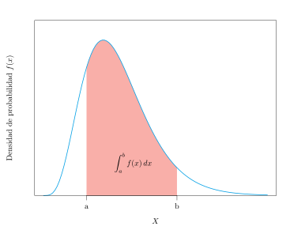{width=70%}
:::

:::{.content-visible unless-format="html"}
{width=70%}
:::

Para ello tenemos dos posibilidades: calcular la integral definida de la función de densidad entre $a$ y $b$, o bien, a partir de la función de distribución, medir el área acumulada por debajo de $b$ y restarle el área acumulada por debajo de $a$, para quedarnos con el área que hay entre ambos valores. Como es más fácil hacer restas que calcular integrales, trabajaremos la mayoría de las veces con funciones de distribución.

:::{#exm-calculo-probabilidades-integral}
## Cálculo de probabilidades con una función de densidad
Dada la siguiente función:

$$
f(x) =
\begin{cases}
0 & \mbox{si } x<0\\
e^{-x} & \mbox{si } x\geq 0,
\end{cases}
$$

veamos que se trata de una función de densidad. Es evidente que la función es no negativa, así que solo hay que comprobar que el área por debajo de ella es 1:

$$
\begin{aligned}
\int_{-\infty}^\infty f(x)\;dx &= \int_{-\infty}^0 f(x)\;dx +\int_0^\infty f(x)\;dx = \int_{-\infty}^0 0\;dx +\int_0^\infty e^{-x}\;dx =\\
&= \left[-e^{-x}\right]_0^{\infty} = -e^{-\infty}+e^0 = 1.
\end{aligned}
$$

Calculemos ahora la probabilidad de que la variable tome un valor entre 0 y 2:

$$
P(0\leq X\leq 2) = \int_0^2 f(x)\;dx = \int_0^2 e^{-x}\;dx = \left[-e^{-x}\right]_0^2 = -e^{-2}+e^0 = 0.8647.
$$
:::

## Estadísticos poblacionales

El cálculo de los estadísticos poblacionales es similar al caso discreto, pero utilizando la función de densidad en lugar de la función de probabilidad, y extendiendo la suma discreta a una integral en todo el recorrido de la variable.

Los más importantes son:

- **Media o esperanza matemática:**

$$
\mu = E(X) = \int_{-\infty}^\infty x f(x)\; dx.
$$

- **Varianza:**

$$
\sigma^2 = Var(X) = \int_{-\infty}^\infty x^2 f(x)\; dx -\mu^2.
$$

- **Desviación típica:**

$$
\sigma = +\sqrt{\sigma^2}.
$$

Otros estadísticos, como la mediana, se definen de forma similar a como se hacía en el caso discreto, pero utilizando la función de distribución.

:::{#exm-estadisticos-densidad-exponencial}
## Estadísticos de una variable continua
Sea $X$ una variable aleatoria con la función de densidad del ejemplo anterior. Su media es

$$
\begin{aligned}
\mu &= \int_{-\infty}^\infty xf(x)\;dx = \int_{-\infty}^0 xf(x)\;dx +\int_0^\infty xf(x)\;dx = \int_{-\infty}^0 0\;dx +\int_0^\infty xe^{-x}\;dx =\\
&= \left[-e^{-x}(1+x)\right]_0^{\infty} = 1.
\end{aligned}
$$

y su varianza vale

$$
\begin{aligned}
\sigma^2 &= \int_{-\infty}^\infty x^2f(x)\;dx -\mu^2 = \int_{-\infty}^0 x^2f(x)\;dx +\int_0^\infty x^2f(x)\;dx -\mu^2 = \\
&= \int_{-\infty}^0 0\;dx +\int_0^\infty x^2e^{-x}\;dx -\mu^2= \left[-e^{-x}(x^2+2x+2)\right]_0^{\infty} - 1^2= 2-1 = 1.
\end{aligned}
$$
:::

## Modelos de distribución de probabilidad continuos

Existen varios modelos de distribución de probabilidad continuos que aparecen con bastante frecuencia en la naturaleza y también como consecuencia de los procesos de muestreo aleatorio simple. Los más importantes son:

- Distribución uniforme continua.
- Distribución beta.
- Distribución normal.
- Distribución exponencial.
- Distribución gamma.
- Distribución gamma inversa.
- Distribución chi-cuadrado.
- Distribución T de Student.
- Distribución F de Fisher-Snedecor.

### Distribución uniforme continua

Cuando todos los valores de una variable continua son equiprobables, se dice que la variable sigue un *modelo de distribución uniforme continua*.

:::{#def-distribucion-uniforme-continua}
## Distribución uniforme continua $U(a,b)$
Una variable aleatoria continua $X$ sigue un modelo de distribución *uniforme* de parámetros $a$ y $b$, y se nota $X\sim U(a,b)$, si su rango es $\mbox{Ran}(X) = [a,b]$ y su función de densidad es

$$
f(x)= \frac{1}{b-a}\quad \forall x\in [a,b].
$$
:::

Obsérvese que $a$ y $b$ son el mínimo y el máximo del rango, respectivamente, y que la función de densidad es constante. Su media y su varianza valen

$$
\mu = \frac{a+b}{2}\qquad \sigma^2=\frac{(b-a)^2}{12}.
$$

:::{#exm-uniforme-continua-generacion}
## Generación aleatoria de un número entre 0 y 1
La generación aleatoria de un número real entre 0 y 1 sigue un modelo de distribución uniforme continua $U(0,1)$. La gráfica de su función de densidad es la siguiente:

:::{.content-visible when-format="html"}
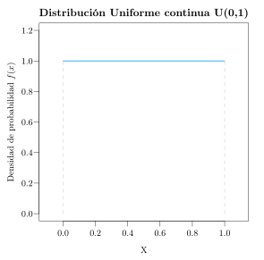{width=60%}
:::

:::{.content-visible unless-format="html"}
{width=60%}
:::

Como se ve, la función es constante y vale 1. Esto debe cumplirse, al ser función de densidad, para que el área total por debajo de ella sea 1, y como en realidad se trata del área de un rectángulo de base 1, la altura debe ser también 1.
:::

Como la función de densidad es constante, la función de distribución presenta un crecimiento lineal. Obsérvese que, como para cualquier función de distribución, la probabilidad acumulada al comienzo del recorrido es 0, y al final vale 1, que es la probabilidad total.

:::{.content-visible when-format="html"}
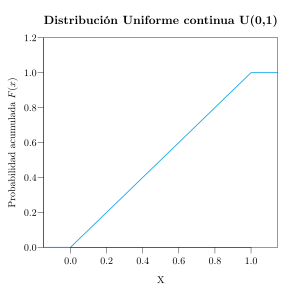{width=60%}
:::

:::{.content-visible unless-format="html"}
{width=60%}
:::

:::{#exm-uniforme-autobus}
## Espera de un autobús
Un autobús pasa por una parada cada 15 minutos. Si una persona puede llegar a la parada en cualquier instante, ¿cuál es la probabilidad de que espere entre 5 y 10 minutos?

Está claro que lo mínimo que puede esperar una persona es 0 minutos, si llega justo cuando está el autobús, y lo máximo es 15 minutos, si llega justo cuando el autobús se marcha. Como además puede llegar en cualquier instante con equiprobabilidad, la variable $X$ que mide el tiempo de espera sigue un modelo de distribución uniforme continua $U(0,15)$.

Así pues, la probabilidad de esperar entre 5 y 10 minutos es

$$
P(5\leq X\leq 10) = \int_{5}^{10} \frac{1}{15}\;dx = \left[\frac{x}{15}\right]_5^{10} = \frac{10}{15}-\frac{5}{15} =\frac{1}{3}.
$$

Aunque también podría calcularse a partir de la gráfica de la función de densidad, que es constante y vale $1/15$, midiendo el área que queda por debajo de esta función entre 5 y 10. Como se trata del área de un rectángulo, basta multiplicar la base, que es 5, por la altura, que es $1/15$, y de nuevo se obtiene $1/3$.

:::{.content-visible when-format="html"}
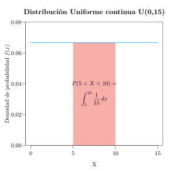{width=60%}
:::

:::{.content-visible unless-format="html"}
{width=60%}
:::

Además, el tiempo medio de espera será $\mu=\frac{0+15}{2}=7.5$ minutos.
:::

### Distribución beta

Cuando una variable continua toma valores en el intervalo $[0,1]$, como ocurre con las proporciones o las probabilidades, pero no todos los valores son igualmente probables, se suele utilizar el *modelo de distribución beta*.

:::{#def-distribucion-beta}
## Distribución beta $\mbox{Beta}(\alpha,\beta)$
Una variable aleatoria continua $X$ sigue un modelo de distribución *beta* de parámetros $\alpha$ y $\beta$, y se nota $X\sim \mbox{Beta}(\alpha,\beta)$, si su rango es $\mbox{Ran}(X)=[0,1]$ y su función de densidad vale

$$
f(x) = \frac{x^{\alpha-1}(1-x)^{\beta-1}}{B(\alpha,\beta)},
$$

donde $\alpha, \beta>0$ son los parámetros de forma y $B(\alpha,\beta)=\frac{\Gamma(\alpha)\Gamma(\beta)}{\Gamma(\alpha+\beta)}$ es la función beta.
:::

:::{.callout-note}
La **función gamma** es una generalización del factorial a los números reales positivos, definida como $\Gamma(\alpha) = \int_0^{+\infty} t^{\alpha-1}e^{-t}\,dt$. Para enteros positivos cumple $\Gamma(n) = (n-1)!$.
:::

El modelo beta se utiliza para modelar proporciones o probabilidades, ya que su rango está acotado en $[0,1]$. Según los valores de $\alpha$ y $\beta$ puede tomar formas muy variadas (simétricas, asimétricas, en forma de U, etc.). Obsérvese que la distribución uniforme $U(0,1)$ es un caso particular de la beta con $\alpha=\beta=1$.

Su media y su varianza valen

$$
\mu = \frac{\alpha}{\alpha+\beta} \qquad \sigma^2 = \frac{\alpha\beta}{(\alpha+\beta)^2(\alpha+\beta+1)}.
$$

:::{#exm-distribucion-beta}
## Proporción de respuesta a un tratamiento
La proporción de individuos que responden positivamente a un tratamiento puede modelarse con una distribución $\mbox{Beta}(2, 5)$.

```{r}
#| label: fig-beta-2-5
#| fig-cap: "Función de densidad de la distribución beta $\\text{Beta}(2, 5)$."
#| fig-alt: "Curva de densidad asimétrica a la derecha con máximo cerca de 0.2."
#| fig-align: center
#| fig-width: 6
#| fig-height: 3.5
# Función de densidad Beta(2, 5)
df <- tibble(x = seq(0, 1, length.out = 300),
             p = dbeta(x, shape1 = 2, shape2 = 5))  # Densidad de probabilidad
# Diagrama de densidad de probabilidad
ggplot(df, aes(x = x, y = p)) +
  geom_area(fill = blueceu, alpha = 0.5) +
  geom_line(color = blueceu, linewidth = 1) +
  labs(x = "Proporción de respuesta al tratamiento", y = "Densidad") +
  theme_minimal()
```
:::

La siguiente figura muestra las gráficas de las funciones de densidad de distribuciones beta con distintos valores de $\alpha$ y $\beta$.

```{r}
#| label: fig-beta-formas
#| fig-cap: "Forma de la distribución beta para distintos valores de $\\alpha$ y $\\beta$."
#| fig-alt: "Nueve densidades beta combinando alfa y beta en 1, 10 y 100."
#| fig-align: center
#| fig-width: 7
#| fig-height: 7
beta_params <- expand.grid(alpha = c(1, 10, 100), beta = c(1, 10, 100))
df_beta <- pmap_dfr(beta_params, function(alpha, beta) {
  tibble(x = seq(0.001, 0.999, length.out = 300),
         y = dbeta(x, shape1 = alpha, shape2 = beta),
         label = factor(paste0("Beta(", alpha, ", ", beta, ")"),
                        levels = paste0("Beta(", beta_params$alpha, ", ", beta_params$beta, ")")))
})

df_beta |>
  ggplot(aes(x = x, y = y)) +
  geom_area(fill = blueceu, alpha = 0.5) +
  geom_line(color = blueceu, linewidth = 1) +
  facet_wrap(~ label, scales = "free_y", nrow = 3) +
  labs(x = "X", y = "Densidad") +
  theme_minimal() +
  theme(strip.text = element_text(size = 11))
```

Como puede observarse, cuando $\alpha=\beta$ la distribución es simétrica respecto de $0.5$, cuando $\alpha>\beta$ la probabilidad se concentra en los valores altos y cuando $\alpha<\beta$ en los bajos. Además, cuanto mayores son $\alpha$ y $\beta$, más concentrada está la distribución en torno a su media.

### Distribución normal

El modelo de distribución normal es, sin duda, el modelo de distribución continuo más importante, ya que es el que con más frecuencia se presenta en la naturaleza, sobre todo en variables continuas biológicas.

:::{#def-distribucion-normal}
## Distribución normal $N(\mu,\sigma)$
Una variable aleatoria continua $X$ sigue un modelo de distribución *normal* de parámetros $\mu$ y $\sigma$, y se nota $X\sim N(\mu,\sigma)$, si su rango es $\mathbb{R}$ y su función de densidad vale

$$
f(x)= \frac{1}{\sigma\sqrt{2\pi}}e^{-\frac{(x-\mu)^2}{2\sigma^2}}.
$$
:::

Los dos parámetros $\mu$ y $\sigma$ son, precisamente, la media y la desviación típica de la población.

La gráfica de la función de densidad de la distribución normal tiene forma de campana, conocida como *campana de Gauss* (en honor a su descubridor), y está centrada en la media $\mu$.

:::{.content-visible when-format="html"}
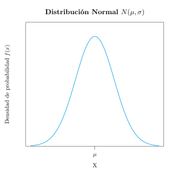{width=60%}
:::

:::{.content-visible unless-format="html"}
{width=60%}
:::

La forma de la campana de Gauss depende de sus dos parámetros:

- La media $\mu$ determina dónde está centrada la campana. En la gráfica de la izquierda se muestran las funciones de densidad de dos normales con desviación típica 1, una con media 0 y otra con media 2. Ambas gráficas son idénticas, salvo que la primera está centrada en el 0 y la segunda en el 2.
- La desviación típica $\sigma$, al ser una medida de la dispersión de la población, determina su anchura. En la gráfica de la derecha se muestran las funciones de densidad de dos normales con media 0 y desviaciones típicas 1 y 2 respectivamente. Ambas están centradas en el 0, pero la primera es más estrecha que la segunda, porque tiene menos dispersión.

:::{.content-visible when-format="html"}
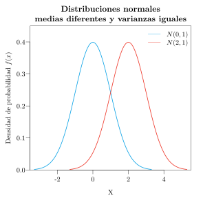{width=48%} 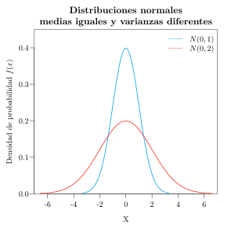{width=48%}
:::

:::{.content-visible unless-format="html"}
{width=48%} {width=48%}
:::

La gráfica de la función de distribución de una normal tiene forma de S.

:::{.content-visible when-format="html"}
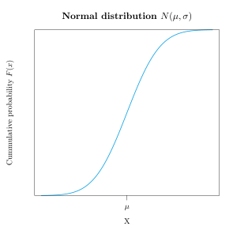{width=60%}
:::

:::{.content-visible unless-format="html"}
{width=60%}
:::

#### Propiedades de la distribución normal

- La función de densidad es simétrica respecto a la media, y por tanto su coeficiente de asimetría es $g_1=0$.
- También es mesocúrtica, ya que tiene forma de campana de Gauss, y por tanto su coeficiente de apuntamiento vale $g_2=0$. Recordemos que el apuntamiento de cualquier variable se compara precisamente con el de la distribución normal, que se toma como referencia por ser la distribución más común.
- Al ser simétrica respecto a la media, hasta la media tenemos acumulada la mitad de la probabilidad. Por tanto, la media coincide con la mediana, y también con la moda, ya que sobre la media se alcanza el máximo de la función de densidad:

$$
\mu = Me = Mo.
$$

- Tiende asintóticamente a 0 cuando $x$ tiende a $\pm \infty$.

Además, se cumple que

$$
\begin{aligned}
& P(\mu-\sigma \leq X \leq \mu+\sigma) = 0.68,\\
& P(\mu-2\sigma \leq X \leq \mu+2\sigma) = 0.95,\\
& P(\mu-3\sigma \leq X \leq \mu+3\sigma) = 0.99.
\end{aligned}
$$

Es decir, casi la totalidad de los individuos de la población presentan valores entre la media menos tres veces la desviación típica y la media más tres veces la desviación típica.

:::{.content-visible when-format="html"}
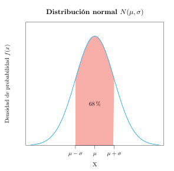{width=32%} 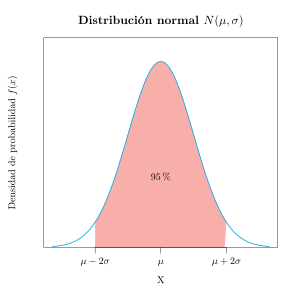{width=32%} 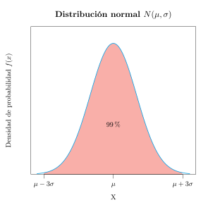{width=32%}
:::

:::{.content-visible unless-format="html"}
{width=32%} {width=32%} {width=32%}
:::

:::{#exm-normal-colesterol}
## Niveles de colesterol
En un estudio se ha comprobado que el nivel de colesterol total en mujeres sanas de entre 40 y 50 años sigue una distribución normal de media 210 mg/dl y desviación típica 20 mg/dl. Atendiendo a las propiedades de la campana de Gauss, se tiene que:

- El 68% de las mujeres sanas tendrán el colesterol entre $210\pm 20$ mg/dl, es decir, entre 190 y 230 mg/dl.
- El 95% de las mujeres sanas tendrán el colesterol entre $210\pm 2\cdot 20$ mg/dl, es decir, entre 170 y 250 mg/dl.
- El 99% de las mujeres sanas tendrán el colesterol entre $210\pm 3\cdot 20$ mg/dl, es decir, entre 150 y 270 mg/dl.

En la analítica sanguínea suele utilizarse el intervalo $\mu\pm 2\sigma$ para detectar posibles patologías. En el caso del colesterol, dicho intervalo es $[170\text{ mg/dl}, 250\text{ mg/dl}]$. Cuando una persona tiene el colesterol fuera de estos límites, se tiende a pensar que tiene alguna patología, aunque ciertamente podría estar sana, pero la probabilidad de que eso ocurra es solo de un 5%.

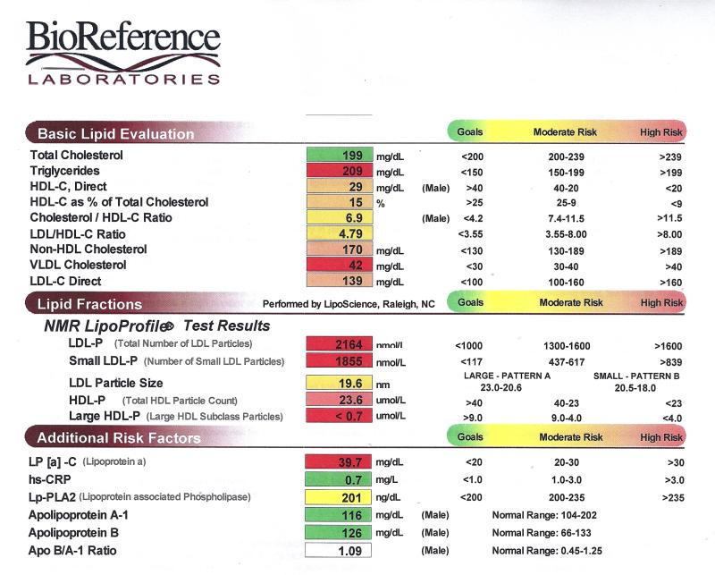{width=50%}
:::

#### El teorema central del límite

El comportamiento de la distribución normal lo presentan muchas variables continuas físicas y biológicas. Si pensamos, por ejemplo, en la distribución de las estaturas, veremos que la mayor parte de los individuos presentan estaturas en torno a la media, tanto por encima como por debajo, pero que a medida que nos alejamos de la media hay cada vez menos individuos con dichas estaturas.

La justificación de que la distribución normal aparezca con tanta frecuencia en la naturaleza la encontramos en el **teorema central del límite**, que veremos más detenidamente en el siguiente tema. Este teorema establece que si una variable aleatoria $X$ proviene de un experimento aleatorio cuyos resultados son debidos a un conjunto muy grande de causas independientes que actúan sumando sus efectos, entonces $X$ sigue una distribución aproximadamente normal.

Por ejemplo, si pensamos en la tensión arterial, rápidamente identificaremos multitud de factores que influyen en ella, como la edad, el sexo, la dieta, el ejercicio físico o si se fuma o no. El valor de la tensión arterial en un individuo es el resultado de todos estos factores, que suman sus efectos de manera independiente, y por ello la tensión arterial acaba teniendo una distribución normal.

#### La distribución normal estándar

De todas las distribuciones normales, la más importante es la que tiene media $\mu=0$ y desviación típica $\sigma=1$, que se conoce como **normal estándar**, y se designa por $Z\sim N(0,1)$. Su función de densidad es una campana de Gauss centrada en el 0, en la que el 99% de los individuos estarán entre -3 y 3.

:::{.content-visible when-format="html"}
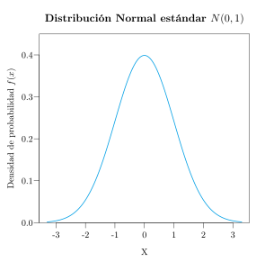{width=60%}
:::

:::{.content-visible unless-format="html"}
{width=60%}
:::

Para evitar tener que calcular probabilidades integrando la función de densidad de la normal estándar, es habitual utilizar su función de distribución, que se suele tabular. En la tabla, la primera columna contiene las décimas y la primera fila las centésimas. Así, para calcular la probabilidad acumulada hasta $0.52$, tenemos que ir a la fila $0.5$ (5 décimas) y a la columna $0.02$ (2 centésimas), donde aparece la probabilidad acumulada $0.6985$. Esta es el área que queda por debajo de la campana de Gauss de la normal estándar entre $-\infty$ y $0.52$.

:::{.content-visible when-format="html"}
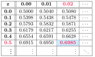{width=60%}
:::

:::{.content-visible unless-format="html"}
{width=60%}
:::

:::{.content-visible when-format="html"}
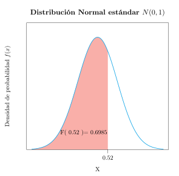{width=50%}
:::

:::{.content-visible unless-format="html"}
{width=50%}
:::

Cuando tengamos que calcular probabilidades acumuladas por encima de un determinado valor (cola de acumulación a la derecha), podemos hacerlo mediante la probabilidad del suceso contrario, ya que la función de distribución siempre mide probabilidades acumuladas por debajo de cada valor. Por ejemplo,

$$
P(Z>0.52) =1-P(Z\leq 0.52) = 1-F(0.52) = 1 - 0.6985 = 0.3015.
$$

Esto es lógico, ya que si el área total por debajo de la campana de Gauss es 1, el área acumulada por encima de $0.52$ será 1 menos el área que queda por debajo de este valor.

:::{.content-visible when-format="html"}
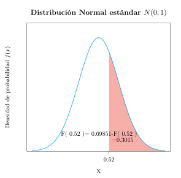{width=50%}
:::

:::{.content-visible unless-format="html"}
{width=50%}
:::

#### Tipificación

Ya sabemos calcular probabilidades con una distribución normal estándar, pero ¿qué hacer cuando la distribución normal no es la estándar? En tal caso hay que transformar la variable normal en una normal estándar.

:::{#thm-tipificacion}
## Tipificación
Si $X$ es una variable que sigue una distribución normal de media $\mu$ y desviación típica $\sigma$, $X\sim N(\mu,\sigma)$, entonces la variable que resulta de restarle a $X$ su media $\mu$ y dividir por su desviación típica $\sigma$ sigue un modelo de distribución normal estándar:

$$
X\sim N(\mu,\sigma) \Rightarrow Z=\frac{X-\mu}{\sigma}\sim N(0,1).
$$

Esta transformación lineal se conoce como *transformación de tipificación*, y la variable resultante $Z$ se conoce como *normal tipificada*.
:::

Así pues, para calcular probabilidades de una variable normal que no sea la estándar, primero se aplica la transformación de tipificación y después se utiliza la función de distribución de la normal estándar.

:::{#exm-tipificacion-notas}
## Porcentaje de suspensos
Supóngase que la nota de un examen sigue un modelo de distribución normal $N(\mu=6,\sigma=1.5)$. ¿Qué porcentaje de suspensos habrá en la población?

Para responder a esta pregunta necesitamos calcular la probabilidad de que la nota sea inferior a 5. Como $X$ no es la normal estándar, se le aplica la transformación de tipificación $Z=\displaystyle \frac{X-\mu}{\sigma} = \frac{X-6}{1.5}$:

$$
P(X<5) = P\left(\frac{X-6}{1.5}<\frac{5-6}{1.5}\right) = P(Z<-0.67).
$$

Después solo queda mirar en la tabla de la función de distribución de la normal estándar:

$$
P(Z<-0.67) = F(-0.67) = 0.2514.
$$

Así pues, habrán suspendido el 25.14% de los alumnos.
:::

### Distribución exponencial

La distribución exponencial está muy relacionada con la distribución de Poisson. Si el número de sucesos que ocurren en un intervalo de tiempo sigue un modelo de Poisson, el tiempo que transcurre hasta que ocurre el primer suceso, o entre dos sucesos consecutivos, sigue un *modelo de distribución exponencial*.

:::{#def-distribucion-exponencial}
## Distribución exponencial $Exp(\lambda)$
Una variable aleatoria continua $X$ sigue un modelo de distribución *exponencial* de parámetro $\lambda$, y se nota $X\sim Exp(\lambda)$, si su rango es $\mbox{Ran}(X)=(0,+\infty)$ y su función de densidad vale

$$
f(x) = \lambda e^{-\lambda x},
$$

donde $\lambda > 0$ es la tasa de ocurrencia del suceso, es decir, el número medio de sucesos por unidad de tiempo.
:::

El modelo exponencial se utiliza para modelar tiempos de espera o duraciones positivas, como el tiempo entre llamadas a una centralita o el tiempo de vida de un paciente.

Su media y su varianza valen

$$
\mu = \frac{1}{\lambda} \qquad \sigma^2 = \frac{1}{\lambda^2}.
$$

:::{#exm-distribucion-exponencial}
## Tiempo hasta una infección
Se sabe que la tasa de infecciones por un virus es de 0.2 por día. Entonces, el tiempo hasta que se produce una infección sigue una distribución exponencial $Exp(0.2)$, y el tiempo medio hasta una infección es $\mu = 1/0.2 = 5$ días.

```{r}
#| label: fig-exponencial-02
#| fig-cap: "Función de densidad de la distribución exponencial $Exp(0.2)$."
#| fig-alt: "Densidad exponencial decreciente desde 0.2 en el origen."
#| fig-align: center
#| fig-width: 6
#| fig-height: 3.5
# Función de densidad Exp(0.2)
df <- tibble(x = seq(0, 30, length.out = 300),
             p = dexp(x, rate = 0.2)) # Densidad de probabilidad
# Diagrama de densidad de probabilidad
ggplot(df, aes(x = x, y = p)) +
  geom_area(fill = blueceu, alpha = 0.5) +
  geom_line(color = blueceu, linewidth = 1) +
  labs(x = "Tiempo hasta la infección (días)", y = "Densidad") +
  theme_minimal()
```
:::

La siguiente figura muestra las gráficas de las funciones de densidad de distribuciones exponenciales con distintos valores de $\lambda$.

```{r}
#| label: fig-exponencial-formas
#| fig-cap: "Forma de la distribución exponencial para distintos valores de $\\lambda$."
#| fig-alt: "Tres densidades exponenciales decrecientes con lambda = 0.1, 0.3 y 0.5."
#| fig-align: center
#| fig-width: 8
#| fig-height: 3
lambdas <- c(0.1, 0.3, 0.5)
df_exp <- tibble(lambda = lambdas) |>
  rowwise() |>
  mutate(x = list(seq(0, qexp(0.99, rate = lambda), length.out = 300)),
         y = list(dexp(x, rate = lambda))) |>
  unnest(cols = c(x, y)) |>
  mutate(label = factor(paste0("λ = ", lambda), levels = paste0("λ = ", lambdas)))

df_exp |>
  ggplot(aes(x = x, y = y)) +
  geom_area(fill = blueceu, alpha = 0.5) +
  geom_line(color = blueceu, linewidth = 1) +
  facet_wrap(~ label, nrow = 1) +
  labs(x = "X", y = "Densidad") +
  theme_minimal() +
  theme(strip.text = element_text(size = 11))
```

Como puede apreciarse, todas son decrecientes y toman el valor $\lambda$ en el origen, de manera que, cuanto mayor es la tasa de ocurrencia, más concentrada está la probabilidad en los tiempos cortos.

### Distribución gamma

La distribución gamma generaliza la exponencial: si los sucesos ocurren con una tasa $\beta$ por unidad de tiempo, el tiempo que transcurre hasta que ocurren $\alpha$ sucesos sigue un *modelo de distribución gamma*.

:::{#def-distribucion-gamma}
## Distribución gamma $\mbox{Gamma}(\alpha,\beta)$
Una variable aleatoria continua $X$ sigue un modelo de distribución *gamma* de parámetros $\alpha$ y $\beta$, y se nota $X\sim \mbox{Gamma}(\alpha,\beta)$, si su rango es $\mbox{Ran}(X)=(0,+\infty)$ y su función de densidad vale

$$
f(x) = \frac{\beta^\alpha}{\Gamma(\alpha)}x^{\alpha-1}e^{-\beta x},
$$

donde $\alpha>0$ es el parámetro de forma, $\beta>0$ el parámetro de tasa y $\Gamma(\alpha)$ la función gamma.
:::

El modelo gamma se utiliza para modelar tiempos de espera o duraciones positivas. Incluye como caso particular la distribución exponencial, ya que $\mbox{Gamma}(1,\lambda)=Exp(\lambda)$, y, para valores grandes de $\alpha$, se aproxima a la normal.

Su media y su varianza valen

$$
\mu = \frac{\alpha}{\beta} \qquad \sigma^2 = \frac{\alpha}{\beta^2}.
$$

:::{#exm-distribucion-gamma}
## Tiempo hasta el tercer contagio
Si los contagios de un virus ocurren a una tasa de 2 por hora, el tiempo hasta el tercer contagio sigue una distribución $\mbox{Gamma}(3, 2)$, y el tiempo medio hasta el tercer contagio es $\mu = 3/2 = 1.5$ horas.

```{r}
#| label: fig-gamma-3-2
#| fig-cap: "Función de densidad de la distribución gamma $\\text{Gamma}(3, 2)$."
#| fig-alt: "Densidad gamma asimétrica a la derecha con máximo en 1 hora."
#| fig-align: center
#| fig-width: 6
#| fig-height: 3.5
# Función de densidad Gamma(3, 2)
df <- tibble(x = seq(0, 5, length.out = 300),
             p = dgamma(x, shape = 3, rate = 2)) # Densidad de probabilidad
# Diagrama de densidad de probabilidad
ggplot(df, aes(x = x, y = p)) +
  geom_area(fill = blueceu, alpha = 0.5) +
  geom_line(color = blueceu, linewidth = 1) +
  labs(x = "Tiempo hasta el tercer contagio (horas)", y = "Densidad") +
  theme_minimal()
```
:::

La siguiente figura muestra las gráficas de las funciones de densidad de distribuciones gamma con distintos valores de $\alpha$ y $\beta$.

```{r}
#| label: fig-gamma-formas
#| fig-cap: "Forma de la distribución gamma para distintos valores de $\\alpha$ y $\\beta$."
#| fig-alt: "Nueve densidades gamma combinando alfa = 1, 10 y 30 con beta = 0.1, 0.2 y 0.3."
#| fig-align: center
#| fig-width: 7
#| fig-height: 7
alpha_vals <- c(1, 10, 30)
beta_vals <- c(0.1, 0.2, 0.3)
labels <- paste0("α = ", rep(alpha_vals, each = 3), ", β = ", rep(beta_vals, 3))

df_gamma <- expand.grid(beta = beta_vals, alpha = alpha_vals) |>
  pmap_dfr(function(alpha, beta) {
    x_max <- qgamma(0.9999, shape = alpha, rate = beta)
    tibble(x = seq(0.001, x_max, length.out = 300),
           y = dgamma(x, shape = alpha, rate = beta),
           label = factor(paste0("α = ", alpha, ", β = ", beta), levels = labels))
  })

df_gamma |>
  ggplot(aes(x = x, y = y)) +
  geom_area(fill = blueceu, alpha = 0.5) +
  geom_line(color = blueceu, linewidth = 1) +
  facet_wrap(~ label, scales = "free", nrow = 3) +
  labs(x = "X", y = "Densidad") +
  theme_minimal() +
  theme(strip.text = element_text(size = 11))
```

Como puede observarse,  para $\alpha=1$ la densidad es decreciente, como la de la exponencial, mientras que al aumentar $\alpha$ la distribución se vuelve más simétrica y se parece cada vez más a una normal.

### Distribución gamma inversa

Si una variable sigue una distribución gamma, su inversa sigue una *distribución gamma inversa*.

:::{#def-distribucion-gamma-inversa}
## Distribución gamma inversa $\mbox{Gamma}^{-1}(\alpha,\beta)$
Una variable aleatoria continua $X$ sigue un modelo de distribución *gamma inversa* de parámetros $\alpha$ y $\beta$, y se nota $X\sim \mbox{Gamma}^{-1}(\alpha,\beta)$, si su rango es $\mbox{Ran}(X)=(0,+\infty)$ y su función de densidad vale

$$
f(x) = \frac{\beta^{\alpha}}{\Gamma(\alpha)}x^{-\alpha-1}e^{-\beta/x},
$$

donde $\alpha>0$ es el parámetro de forma, $\beta>0$ el parámetro de escala y $\Gamma(\alpha)$ la función gamma.
:::

Si $X\sim \mbox{Gamma}(\alpha, \beta)$, entonces $1/X\sim \mbox{Gamma}^{-1}(\alpha, \beta)$. La distribución gamma inversa se utiliza habitualmente para modelar varianzas en estadística bayesiana.

Su media, para $\alpha>1$, y su varianza, para $\alpha>2$, valen

$$
\mu = \frac{\beta}{\alpha-1} \qquad \sigma^2 = \frac{\beta^2}{(\alpha-1)^2(\alpha-2)}.
$$

La siguiente figura muestra las gráficas de las funciones de densidad de distribuciones gamma inversa con distintos valores de $\alpha$ y $\beta$.

```{r}
#| label: fig-gamma-inversa-formas
#| fig-cap: "Forma de la distribución gamma inversa para distintos valores de $\\alpha$ y $\\beta$."
#| fig-alt: "Nueve densidades gamma inversa combinando alfa = 5, 10 y 15 con beta = 1, 5 y 10."
#| fig-align: center
#| fig-width: 7
#| fig-height: 7
# Densidad y cuantiles de la gamma inversa a partir de la gamma
dinvgamma <- function(x, alpha, beta) dgamma(1/x, shape = alpha, rate = beta) / x^2
qinvgamma <- function(p, alpha, beta) 1 / qgamma(1 - p, shape = alpha, rate = beta)
alpha_vals <- c(5, 10, 15)
beta_vals <- c(1, 5, 10)
labels <- paste0("α = ", rep(alpha_vals, each = 3), ", β = ", rep(beta_vals, 3))

df_gamma_inv <- expand.grid(beta = beta_vals, alpha = alpha_vals) |>
  pmap_dfr(function(alpha, beta) {
    x_max <- qinvgamma(0.99, alpha = alpha, beta = beta)
    tibble(x = seq(0.001, x_max, length.out = 300),
           y = dinvgamma(x, alpha = alpha, beta = beta),
           label = factor(paste0("α = ", alpha, ", β = ", beta), levels = labels))
  })

df_gamma_inv |>
  ggplot(aes(x = x, y = y)) +
  geom_area(fill = blueceu, alpha = 0.5) +
  geom_line(color = blueceu, linewidth = 1) +
  facet_wrap(~ label, scales = "free", nrow = 3) +
  labs(x = "X", y = "Densidad") +
  theme_minimal() +
  theme(strip.text = element_text(size = 11))
```

Como puede verse, todas son asimétricas a la derecha. Al aumentar $\beta$ la distribución se desplaza hacia valores más altos y se vuelve más dispersa, mientras que al aumentar $\alpha$ se desplaza hacia valores más bajos y se concentra más.

### Distribución chi-cuadrado

:::{#def-distribucion-chi-cuadrado}
## Distribución chi-cuadrado $\chi^2(n)$
Dadas $n$ variables aleatorias independientes $Z_1,\ldots,Z_n$, todas ellas siguiendo un modelo de distribución normal estándar, la variable

$$
\chi^2(n) = Z_1^2+\cdots +Z_n^2
$$

sigue un modelo de distribución de probabilidad *chi-cuadrado de $n$ grados de libertad*.
:::

Su recorrido es $\mathbb{R}^+$, y su media y su varianza valen

$$
\mu = n, \qquad \sigma^2 = 2n.
$$

Como se verá más adelante, la distribución chi-cuadrado juega un papel importante en la estimación de la varianza poblacional y en el estudio de la relación entre variables cualitativas.

La gráfica de la función de densidad de varias distribuciones chi-cuadrado con distintos grados de libertad es la siguiente. Como se puede apreciar, al ser una suma de cuadrados, no presenta valores negativos, y a diferencia de la normal, siempre es asimétrica hacia la derecha.

:::{.content-visible when-format="html"}
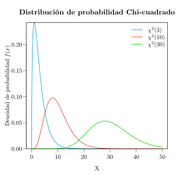{width=60%}
:::

:::{.content-visible unless-format="html"}
{width=60%}
:::

Algunas propiedades de la distribución chi-cuadrado son:

- No toma valores negativos.
- Si $X\sim \chi^2(n)$ e $Y\sim \chi^2(m)$ son independientes, entonces

$$
X+Y \sim \chi^2(n+m).
$$

- Al aumentar el número de grados de libertad, se aproxima asintóticamente a una normal.

### Distribución T de Student

:::{#def-distribucion-t-student}
## Distribución T de Student $T(n)$
Sean $Z\sim N(0,1)$ una variable normal estándar y $X\sim \chi^2(n)$ una variable chi-cuadrado de $n$ grados de libertad, ambas independientes. Entonces la variable

$$
T = \frac{Z}{\sqrt{X/n}}
$$

sigue un modelo de distribución *T de Student de $n$ grados de libertad*, y se nota $T\sim T(n)$.
:::

Su recorrido es $\mathbb{R}$, y su media y su varianza valen

$$
\mu = 0, \qquad \sigma^2 = \frac{n}{n-2} \mbox{ si } n>2.
$$

Como se verá más adelante, la distribución T de Student juega un papel importante en la estimación de la media poblacional.

La gráfica de la función de densidad de varias distribuciones T de Student con distintos grados de libertad es la siguiente. Como se puede apreciar, esta distribución está centrada en el 0 y es muy parecida a la normal estándar, aunque algo más platicúrtica.

:::{.content-visible when-format="html"}
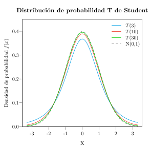{width=60%}
:::

:::{.content-visible unless-format="html"}
{width=60%}
:::

Algunas propiedades de la distribución T de Student son:

- La media, la mediana y la moda coinciden: $\mu=Me=Mo$.
- Es simétrica, por lo que $g_1=0$.
- Tiende asintóticamente a la distribución normal estándar a medida que aumentan los grados de libertad. En la práctica, para $n\geq 30$ ambas distribuciones son aproximadamente iguales:

$$
T(n)\stackrel{n\rightarrow \infty}{\approx}N(0,1).
$$

### Distribución F de Fisher-Snedecor

:::{#def-distribucion-f-fisher}
## Distribución F de Fisher-Snedecor $F(m,n)$
Sean $X\sim \chi^2(m)$ e $Y\sim \chi^2(n)$ dos variables chi-cuadrado con $m$ y $n$ grados de libertad, respectivamente, independientes entre sí. Entonces la variable

$$
F = \frac{X/m}{Y/n}
$$

sigue un modelo de distribución *F de Fisher-Snedecor de $m$ y $n$ grados de libertad*, y se nota $F\sim F(m,n)$.
:::

Su recorrido es $\mathbb{R}^+$, y su media y su varianza valen

$$
\mu = \frac{n}{n-2} \mbox{ si } n>2, \qquad \sigma^2 =\frac{2n^2(m+n-2)}{m(n-2)^2(n-4)}\mbox{ si } n>4.
$$

Como se verá más adelante, la distribución F de Fisher-Snedecor juega un papel importante en la comparación de varianzas poblacionales y en el análisis de la varianza.

La gráfica de la función de densidad de varias distribuciones F de Fisher-Snedecor con distintos grados de libertad es la siguiente. Al igual que la distribución chi-cuadrado, no presenta valores negativos, y siempre es asimétrica hacia la derecha.

:::{.content-visible when-format="html"}
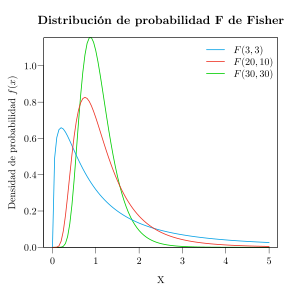{width=60%}
:::

:::{.content-visible unless-format="html"}
{width=60%}
:::

Algunas propiedades de la distribución F de Fisher-Snedecor son:

- No está definida para valores negativos.
- Si $X\sim F(m,n)$, entonces $1/X\sim F(n,m)$. Por tanto, si llamamos $f(m,n)_p$ al valor que cumple $P(F(m,n)\leq f(m,n)_p)=p$, se cumple

$$
f(m,n)_p =\frac{1}{f(n,m)_{1-p}}.
$$

Esto resulta muy útil para utilizar las tablas de su función de distribución.

## Aplicación para las distribuciones de probabilidad continuas

El siguiente enlace lleva a una aplicación web interactiva que permite visualizar las principales distribuciones de probabilidad continuas, explorando cómo cambian su función de densidad y su función de distribución al modificar sus parámetros.

[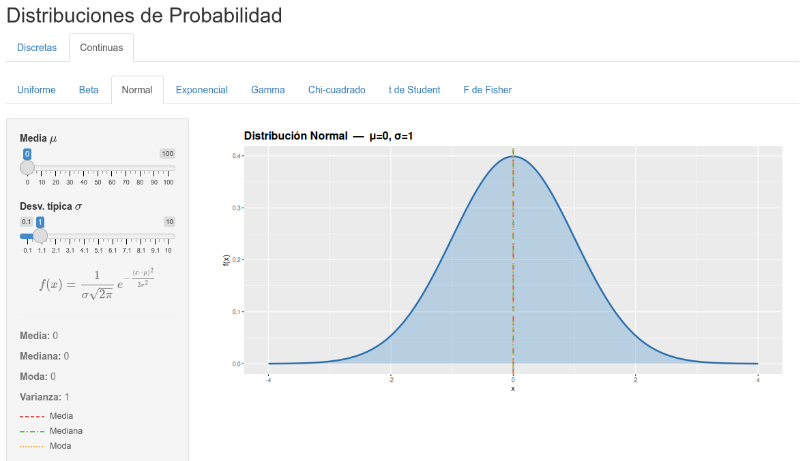](https://nube.aprendeconalf.es/shiny/distribuciones/)
